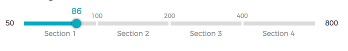

# React Range Slider with Sections
[![Standard Code Style][std_img]][std_site]
> A fast & lightweight responsive touch-friendly react slider component with sections.



Check out [project page](https://exelnait.github.io/react-range-slider/) and [demo](https://exelnait.github.io/react-range-slider/demo/index.html)


## Example

```js
import React, { PureComponent } from 'react'
import Slider from 'react-range-slider'

class PriceCountSlider extends PureComponent {
  constructor(props, context) {
    super(props, context)
    this.state = {
      count: 0
    }
  }
  handleOnChange = (value) => {
    this.setState({
      count: value
    })
  }
  render() {
    return (
      <Slider
        range={[50, 100, 200, 400, 800]}
        onChange={this.handleOnChange}
      />
    )
  }
}
```

## API
Range slider is bundled as a single component, that accepts data and callbacks only as `props`.

### Props
Prop   	 			 |  Type      |  Required  |  Description
---------   	     |  -------   |  -------   |  -----------
`range`              |  array     |  true      |  array with ascending numbers. `[50, 100, 200, 400, 800]`
`onChange`  	     |  function  |            |  function gets called whenever the slider handle is being dragged or clicked

## Development
To work on the project locally, you need to pull its dependencies and run `npm start`.

```bash
$ npm install
$ npm start
```

To start tests you need to run `npm test`.

To check linting you need to run `npm run lint`.

## Issues
Feel free to contribute. Submit a Pull Request or open an issue for further discussion.

## License
Licensed under MIT License. Copyright © 2017 Timofey Lavrenyuk

See [LICENSE](./LICENSE) for more information.

[std_img]: https://img.shields.io/badge/code%20style-standard-brightgreen.svg
[std_site]: http://standardjs.com